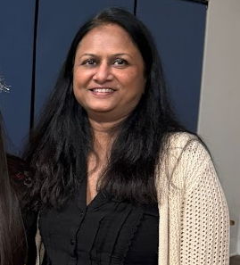
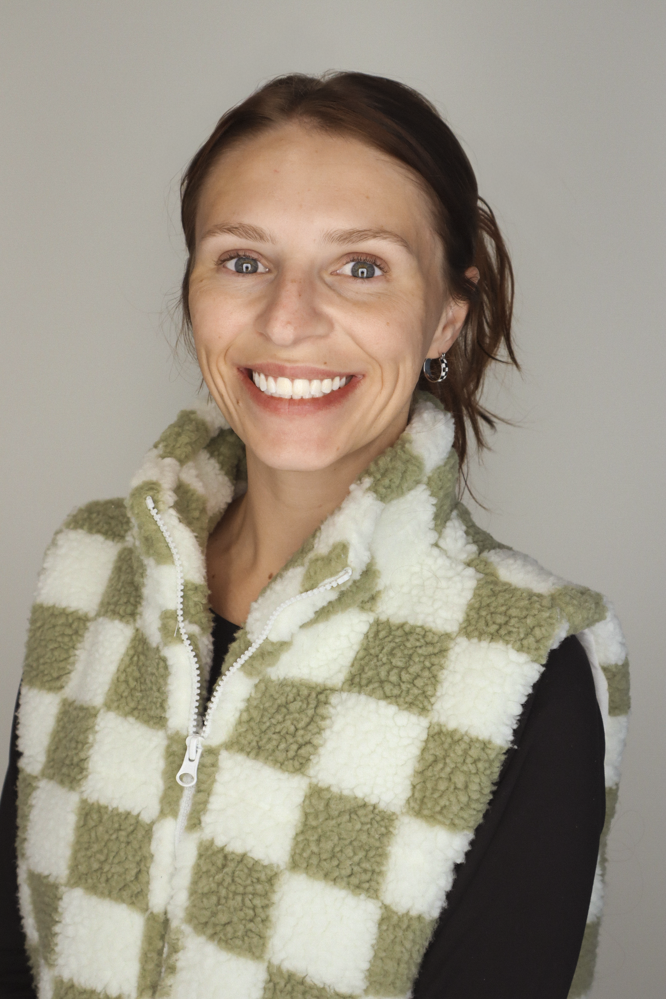

**Dr. Namita Mishra** is a physician, Head and Neck surgeon, and public health researcher with a strong foundation in medicine, epidemiology, and data science. She holds a Master’s degree in Data Science with a specialization in Health Analytics from the University of West Florida.

Her work focuses on the early detection and prevention of non-communicable diseases (cancer, obesity) and on health disparities at the community level. She has conducted research on salivary gland tumors, cardiac implants, and community-based healthy food access. Leveraging her skills in data science, she integrates statistical modeling and Bayesian methods into her analyses. Her bioinformatics expertise includes using geodata visualization tools (3D maps and GIS) for presentations. Passionate about bridging clinical insight with data-driven approaches, she is dedicated to advancing sustainable, evidence-based solutions in epidemiology and community health.

Outside of work, she enjoys gardening, cooking, singing, and sewing.

Dr. Mishra developed the project plan, content draft, analytic coding, and coordinated commits and collaboration with the group on GitHub.

📧 Contact: nmishra\@uwf.edu

**Autumn S. Wilcox** is a U.S. Navy Disabled Veteran who holds a Master’s degree in Data Science with a specialization in Analytics and Modeling from the University of West Florida. She has over 10 years of experience in Network Operations and Technical Writing, including her current role at Navy Federal Credit Union, where she supports enterprise technology and process documentation initiatives. Autumn also holds certification in Clinical Research Quality Management (CRQM) and has contributed to quality oversight and compliance efforts in clinical research settings.

Her background bridges technology, analytics, and healthcare, with a focus on applying data-driven approaches to improve communication and systems reliability. Outside of work, Autumn enjoys traveling, photography, and finding creative inspiration through music.

Autumn contributed to analytic coding, content draft, structured the project workflow, and collaborated actively via GitHub.

📧 Contact: aswilcox97\@gmail.com
